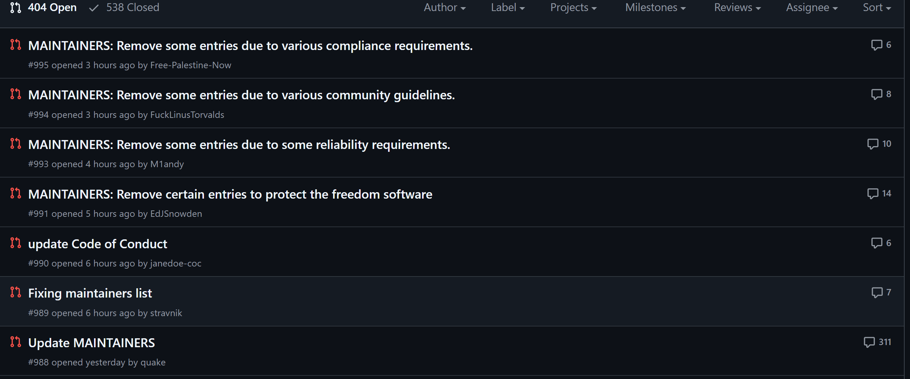

+++
date = 2024-10-24T21:09:40+08:00
draft = false
title = '踢除全部华为开发者？Linux社区发生了什么？'
author = 'Butterblock233'
tags = ['杂谈']
categories = ["计算机"]
+++
想必各位都已经了解了近期Linux项目“暗箱操作”踢除俄罗斯维护者的新闻了。本文简单梳理一下近日的一些情况以及在Github上的那几个抽象Pull Request的来龙去脉。

## 前景提要
事情起因是在上周天，数名俄罗斯籍的linux内核maintainner被无故革除维护者身份。具体可以在[这里](https://aosc.io/news/detail/2024-10-24-condemnation-of-the-linux-foundation-and-its-employees.zh-cn.md)查看详情，本文限于篇幅不再赘述。
## 社区回应
此事件引起了社区的强烈反对。除了正常的再论坛和邮件列表提出异议，部分开发者还在[pull requests](https://github.com/torvalds/linux/pull)上，模仿linus本人的言论进行大规模的反串。

这里简单梳理这几个PR。
- [No.988](https://github.com/torvalds/linux/pull/988)此PR~~拉开了反串的序幕~~提议“移除所有华为开发者”。该帖子是目前评论数最多的一个，内容涵盖抽象、反串、国际友人、引战、人身攻击、VV老师等等等等简中互联网精髓(存疑)，完全值得各位乐子人一读；
- [No.989](https://github.com/torvalds/linux/pull/989)此PR提议移除全部mainntainner名单  ~~从源头上解决问题~~；
- [No.990](https://github.com/torvalds/linux/pull/990)此PR修改了Code of Conduct，删除了“不分国籍一律平等”的条目；
- [No.991](https://github.com/torvalds/linux/pull/991)此PR提议移除所有Google开发者；
No.993-No.995的PR提议移除*Linus Torvalds**等核心开发者(大爆笑)；
>Note:这几个帖子都是**反串**，请不要人身攻击他人。
## 个人感受
~~如果当初知道这样就去阻止了，~~  开源社区以这样一种极度“抽象”的方式对项目的政治正确风波做了有力回击，阐明了自己的立场，并给广大网友带来了极为丰富的乐子。

这里引用一位网友的评论：
> 既然linus喜欢整抽象活，那就要感受一下简中互联网的抽象水平了

平心而论，这几个PR让我笑了一整天。让我度过了接触计算机以来最精彩的10.24节。最后祝各位节日快乐，也希望Linux社区仍然可以健康发展🎉🎉